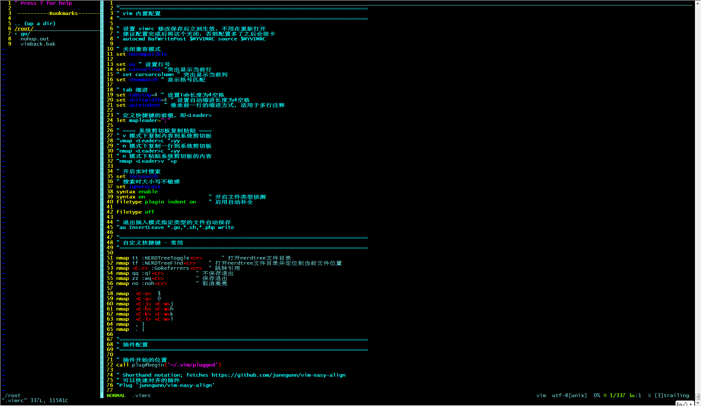
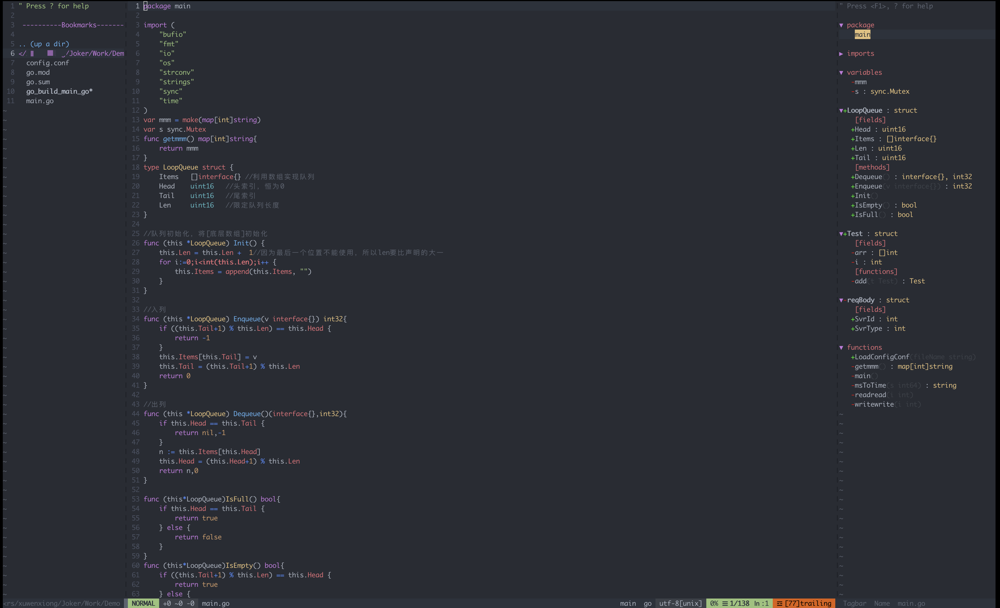

# 个人VIM配置 - mac&linux

> mac支持golang相关配置,linux暂未支持(调试未通过,目前仅配置了快捷键、配色等通用插件)

~~~bash
# 使用Plug管理vim插件
$ curl -fLo ~/.vim/autoload/plug.vim --create-dirs https://raw.githubusercontent.com/junegunn/vim-plug/master/plug.vim

#linux(win环境通过secureCRT登录后配色仍然生效 - CRT需设置Xterm ANSI颜色)
$ cd ~ && wget https://raw.githubusercontent.com/Joker1222/Personal-IDE-Config/main/vim/linux_secureCRT.vimrc && mv linux_secureCRT.vimrc .vimrc  

#mac环境使用的插件多一些,配置起来稍微比较麻烦
$ cd ~ && wget https://raw.githubusercontent.com/Joker1222/Personal-IDE-Config/main/vim/mac_iterm.vimrc && mv mac_iterm.vimrc .vimrc      

$ :PlugInstall                              #拷贝vimrc后安装插件 - linux到这一步就ok了
~~~

## Mac的配置过程

**安装vim-go**
~~~bash
$ apt-get install ctags    #(mac brew安装)
$ apt-get install gtags 
:GoInstallBinaries
~~~

**安装YouCompleteMe (python3.6以上)**
~~~bash
# 安装python3.6
$ apt-get install zlib1g-dev 
$ mkdir -p /opt/python3 && cd /opt/python3/
$ wget https://www.python.org/ftp/python/3.6.1/Python-3.6.1.tgz
$ tar -zxvf Python-3.6.1.tgz
$ cd Python-3.6.1 && ./configure --prefix=/usr/local/python3 && make && make install
~~~

~~~bash
# 安装YouCompleteMe
$ apt install build-essential cmake python3-dev
$ cd ~/.vim/plugged/YouCompleteMe
$ python3 install.py --go-completer #编译，并加入 go 的支持
~~~

## 常用快捷键

| My Keymap| Dafult Keymap | Desc | 
|-|-|-|
| ctrl + h | ctrl + w + h |窗口跳转 左|
| ctrl + j | ctrl + w + j |窗口跳转 下|
| ctrl + k | ctrl + w + k |窗口跳转 上|
| ctrl + l | ctrl + w + l |窗口跳转 右|
| qq | :q! |不保存退出|
| zz | :wq |保存退出|
| , | shift + [ | 上翻一段 |
| . | shitf + ] | 下翻一段 |
|tt | :NERDTreeToggle<cr> | 打开nerdtree目录结构|
|tf | :NERDTreeFind<cr> | 以当前文件为根节点打开nerdtree目录结构|
|no | :noh<cr> | 取消搜索高亮|
|ctrl + p | ctrlp | 搜索当前文件目录下的所有文件|
 
| nerdtree |  Desc | 
|-|-|
| o | 在已有窗口中打开文件、目录或书签，并跳到该窗口|
| shift + o | 递归打开选中 结点下的所有目录|
| shift + c | 将选中目录或选中文件的父目录设为根结点|
| q | 关闭NerdTree窗口|
| t | 在新Tab中打开选中文件/书签，并跳到新Tab |
| i | split一个新窗口打开选中文件，并跳到该窗口|
| p | 跳到父结点 |
| r | 递归刷新选中目录 |
| m | amdc 文件操作(新建、移动、删除、复制当前文件) |

~~~vim
1.批量注释
:v         #选择
:control+v #进入列编辑模式
:shift+i   #编辑注释代码
:esc+esc   #快速按两次esc

2.反注释
:control+v #列编辑模式
:d         #批量删除即可
~~~

## Linux效果

## Mac效果

